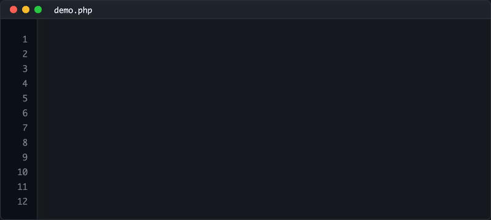
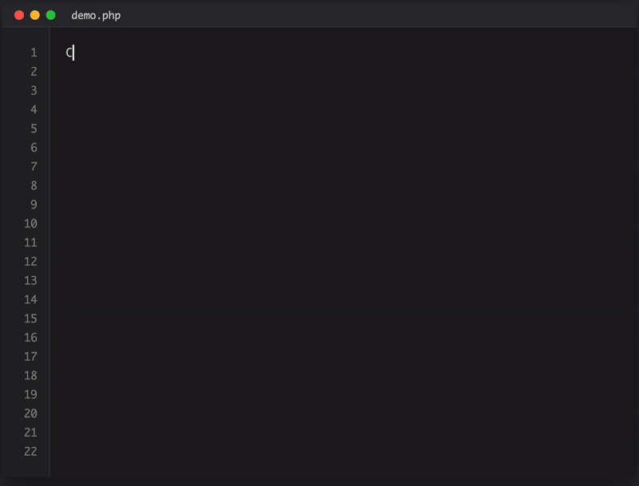

# Laravel Prose

[](https://github.com/sulimanbenhalim/laravel-prose/blob/main/LICENSE.md)
[](https://www.php.net/supported-versions.php)
[](https://laravel.com/docs/12.x/releases)

> Laravel Eloquent queries → natural language descriptions



## Install

```bash
composer require sulimanbenhalim/laravel-prose
```

## Usage

### Basic Query Translation

```php
User::where('created_at', '>', '2024-01-01')->describe();
// → "Find users created after January 1, 2024"

Product::where('is_featured', true)
    ->orderBy('price_usd', 'desc')
    ->limit(10)
    ->describe();
// → "Find first 10 products that are featured sorted by price in USD (highest to lowest)"
```

### Advanced Operations

```php
// Carbon operations with natural language
Order::where('created_at', '>', now()->subWeeks(2))->describeCount();
// → "Count orders created within the last 14 days"

Customer::whereHas('orders', function($q) {
    $q->where('total_amount_usd', '>', 1000);
})->describe();
// → "Find customers who have orders with total amount in USD greater than 1000"

// Multi-column searches
Product::whereAny(['name', 'description'], 'like', '%laptop%')->describe();
// → "Find products whose either name or description contain 'laptop'"
```

### Action Descriptions

All query operations get natural descriptions:



```php
Customer::where('status', 'banned')->describeDelete();
// → "Delete customers with status is 'banned'"

User::where('last_login_at', '<', now()->subYears(2))
    ->whereNull('email_verified_at')
    ->describeDelete();
// → "Delete users with last login more than 2 years ago and with unverified email"

Customer::where('email_verified_at', null)->describeUpdate(['email_verified_at' => now()]);
// → "Update customers with unverified email to be verified"

Product::where('stock_quantity_available', 0)
    ->where('is_currently_available', true)
    ->describeUpdate(['is_currently_available' => false]);
// → "Update products with stock quantity available is 0 and that are currently available to not be currently available"

Order::where('order_status', 'pending')
    ->where('created_at', '<', now()->subHours(24))
    ->describeUpdate(['order_status' => 'cancelled']);
// → "Update orders with order status is 'pending' and created before yesterday to have cancelled order status"

Product::where('stock_quantity_available', 0)->describeDelete();
// → "Delete products with stock quantity available is 0"

Order::where('order_status', 'completed')->describeSum('total_amount_usd');
// → "Sum total amount in USD for orders with order status is 'completed'"

Customer::where('is_premium_member', true)->describeAvg('total_lifetime_spending_usd');
// → "Average total lifetime spending in USD for customers that are premium member"
```

### Relationship Intelligence

```php
Order::with('customer', 'products')->describe();
// → "Find orders including their customer and products"

Customer::whereDoesntHave('orders')->describe();  
// → "Find customers who don't have orders"

Order::where('order_status', 'shipped')
    ->with('customer', 'products')
    ->describe();
// → "Find orders with order status is 'shipped' including their customer and products"
```

## Time Intelligence

| Input | Natural Output |
|-------|----------------|
| `now()->subMinutes(30)` | "within the last 30 minutes" |
| `now()->subDays(7)` | "within the last 7 days" | 
| `now()->subWeeks(2)` | "within the last 14 days" |
| `now()->addDays(14)` | "in the next 14 days" |
| `today()` | "today" |
| `'2024-01-01'` | "January 1, 2024" |

## Field Intelligence

### Boolean Detection
```php
Customer::where('is_premium_member', true)->describe();
// → "Find customers that are premium member"

Product::where('has_warranty', false)->describe();  
// → "Find products that don't have warranty"
```

### Laravel Timestamps
```php
Customer::where('email_verified_at', '>', now()->subDays(30))->describe();
// → "Find customers who verified their email within the last 30 days"

Customer::whereNull('email_verified_at')->describe();
// → "Find customers with unverified email"
```

### Currency & Units
```php
Product::where('price_usd', '>', 100)->describe();
// → "Find products with price in USD greater than 100"

Customer::whereBetween('total_lifetime_spending_usd', [500, 5000])->describe();
// → "Find customers with total lifetime spending in USD ranging from 500 to 5000"
```

## Configuration

```bash
php artisan vendor:publish --tag=prose-config
```

<details>
<summary><strong>All Settings</strong></summary>

| Setting | Default | Description |
|---------|---------|-------------|
| `enabled` | `true` | Enable/disable prose generation |
| `humanize_dates` | `true` | Convert dates to natural language |
| `max_conditions` | `12` | Limit conditions to prevent overflow |
| `include_raw_fallback` | `true` | Show fallback for complex queries |
| `raw_fallback_text` | `"with custom database operations"` | Text for unsupported operations |
| `sentence_template` | `"{action} {model} {conditions}..."` | Output structure |
| `actions.select` | `"Find"` | Action word for select queries |
| `actions.count` | `"Count"` | Action word for count queries |
| `connectors.and` | `"and"` | Connector for AND conditions |
| `connectors.relationships` | `"including their"` | Relationship connector |

</details>

## Methods

### Query Description
```php
$builder->describe();                    // Basic description
$builder->describeCount();               // Count operation  
$builder->describeSum($column);          // Sum operation
$builder->describeAvg($column);          // Average operation
$builder->describeMax($column);          // Maximum operation
$builder->describeMin($column);          // Minimum operation
$builder->describeUpdate($values);       // Update operation
$builder->describeDelete();              // Delete operation
```

### Facade Access
```php
use SulimanBenhalim\Prose\Facades\Prose;

Prose::describe($builder);              // Direct access
```

## Real-World Scenarios

### E-commerce Analytics
```php
// Complex product analysis
Product::where('is_featured', true)
    ->where('stock_quantity_available', '>', 0) 
    ->whereHas('reviews', function($q) {
        $q->where('rating', '>=', 4);
    })
    ->with('category', 'reviews')
    ->orderBy('sales_count', 'desc')
    ->limit(20)
    ->describe();

// → "Find first 20 products that are featured, with stock quantity available 
//    greater than 0 and who have product reviews with rating greater than or equal to 4 
//    including their category and reviews sorted by sales count (highest to lowest)"
```

### User Behavior Analysis  
```php
// Recently active premium users
Customer::where('is_premium_member', true)
    ->where('last_login_at', '>', now()->subDays(7))
    ->whereNotNull('email_verified_at')
    ->with('subscriptions')
    ->orderBy('total_lifetime_spending_usd', 'desc')
    ->describe();

// → "Find customers that are premium member, with last login within the last 7 days 
//    and with verified email including their subscriptions sorted by total lifetime 
//    spending in USD (highest to lowest)"
```

## Laravel Integration

The package seamlessly integrates with Laravel's query builder through macros, automatically detecting:

- **Model casts** for boolean/date field detection
- **Database schema** via Doctrine DBAL for precise field types  
- **Laravel conventions** for timestamp and relationship naming
- **Carbon operations** for intelligent time phrase generation
- **Doctrine Inflector** for proper pluralization and word transformations

## Performance

- **Zero query execution** - descriptions are generated from builder state
- **Configurable limits** prevent description overflow
- **Lazy evaluation** - only processes when `describe()` is called

## Laravel Version Compatibility

| Laravel Version | Package Version |
|-----------------|-----------------|
| 12.x            | 1.x             |

## Security

If you discover any security issues, please email soliman.benhalim@gmail.com instead of using the issue tracker.

## License

The MIT License (MIT). Please see [License File](LICENSE.md) for more information.